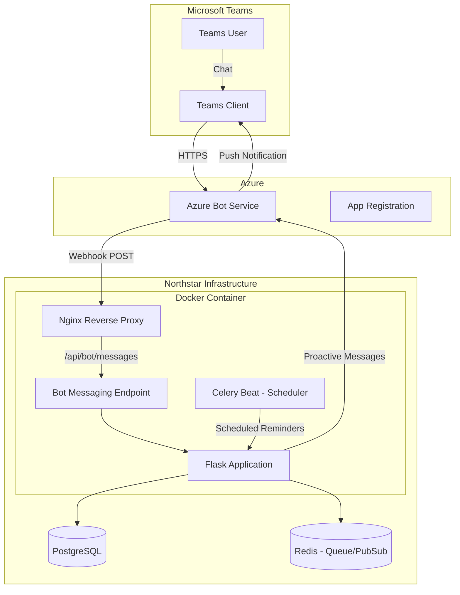

# Northstar Timesheets Bot - Microsoft Teams Integration

> **Planning Document for Microsoft Teams Chatbot Integration**
>
> This bot will provide a conversational interface for timesheet management, proactive notifications, and deep linking into the Northstar Timesheet web application.

---

## 🎯 Overview

### Current Reference Implementation


_Existing Timesheets Bot showing greeting message and reminder notification with deep link_

### Bot Capabilities

Based on the reference implementation, the bot will support:

| Capability                  | Description                                                      |
| --------------------------- | ---------------------------------------------------------------- |
| **Greeting/Onboarding**     | Welcome message explaining available commands                    |
| **Command Processing**      | Natural language intents like "Submit hours", "Create timesheet" |
| **Proactive Notifications** | Push reminders for missing timesheets, approval status updates   |
| **Deep Linking**            | "Open in Timesheets App" buttons that link to specific pages     |
| **Adaptive Cards**          | Rich interactive UI components for notifications                 |

---

## 🏗 Architecture



### Key Components

| Component               | Technology                   | Purpose                                  |
| ----------------------- | ---------------------------- | ---------------------------------------- |
| **Bot Framework**       | `teams-sdk` (Python)         | Handle Teams activities, messages, cards |
| **Messaging Endpoint**  | Flask Blueprint `/api/bot/*` | Receive and process bot webhooks         |
| **Proactive Messaging** | Azure Bot Service API        | Send notifications without user prompt   |
| **Scheduler**           | Celery Beat + Redis          | Friday afternoon reminder jobs           |
| **Conversation Store**  | PostgreSQL                   | Store user conversation references       |

---

## 📋 Bot Features

### Phase 1: Core Messaging

#### 1.1 Welcome Message

When a user first interacts with the bot:

```
Hi! I'm NorthStar's Timecards virtual agent.

You can say things like:
• "Submit hours" - Open your current timesheet
• "Create timesheet" - Start a new timesheet
• "View my timesheets" - See your timesheet history
• "Help" - Get more information

I'll also send you important updates and reminders regarding your timesheets.
```

#### 1.2 Command Intents

| User Says                           | Intent             | Bot Response                               |
| ----------------------------------- | ------------------ | ------------------------------------------ |
| "Submit hours", "Submit timesheet"  | `submit_hours`     | Link to current week's draft or create new |
| "Create timesheet", "New timesheet" | `create_timesheet` | Link to create timesheet page              |
| "View my timesheets", "History"     | `view_timesheets`  | Link to timesheets list                    |
| "Help", "What can you do?"          | `help`             | Show available commands                    |
| "Status", "Check status"            | `check_status`     | Show pending timesheets and their status   |

#### 1.3 Deep Links

The bot will use Adaptive Cards with action buttons:

```json
{
  "type": "AdaptiveCard",
  "body": [
    {
      "type": "TextBlock",
      "text": "You have not submitted last week's timesheet.",
      "wrap": true
    }
  ],
  "actions": [
    {
      "type": "Action.OpenUrl",
      "title": "Open in Timesheets App",
      "url": "https://timesheet.northstar.com/app?week=2026-01-05"
    }
  ]
}
```

### Phase 2: Proactive Notifications

#### 2.1 Weekly Reminder (Friday 2pm)

**Trigger**: Celery Beat scheduled job every Friday at 2:00 PM CST

**Recipients**: Users without a submitted timesheet for the current week

**Message**:

```
📋 Timesheet Reminder

You have not submitted this week's timesheet.

Week: Jan 5 - Jan 11, 2026

[Open in Timesheets App]
```

#### 2.2 Approval Notification

**Trigger**: Admin approves timesheet (from Flask webhook)

**Message**:

```
✅ Timesheet Approved

Your timesheet for week of Jan 5, 2026 has been approved!

[View Timesheet]
```

#### 2.3 Needs Attention Notification

**Trigger**: Admin marks timesheet as needs approval (missing attachment)

**Message**:

```
⚠️ Timesheet Needs Attention

Your timesheet for week of Jan 5, 2026 requires additional documentation.

Please upload the required attachment and resubmit.

[Open Timesheet]
```

### Phase 3: Enhanced Features

#### 3.1 Quick Status Check

Respond to "status" with current week summary:

```
📊 Your Timesheet Status

Current Week (Jan 5 - Jan 11):
• Status: Draft
• Hours logged: 32/40
• Field hours: 24
• PTO: 8

[Open Timesheet] [Submit Now]
```

#### 3.2 Admin Notifications (Optional)

Notify admins when timesheets are submitted:

```
📥 New Timesheet Submitted

John Smith submitted their timesheet for week of Jan 5, 2026

Total hours: 40
• Field: 32 hours
• Internal: 8 hours

[Review Timesheet]
```

---

## 💾 Database Schema Additions

### TeamsConversation Table

Store conversation references for proactive messaging:

```python
class TeamsConversation(db.Model):
    """
    Stores Teams conversation references for proactive messaging.

    Required for sending notifications outside of user-initiated conversations.
    """
    __tablename__ = "teams_conversations"

    id = db.Column(db.String(36), primary_key=True, default=lambda: str(uuid.uuid4()))
    user_id = db.Column(db.String(36), db.ForeignKey("users.id"), nullable=False, unique=True)

    # Bot Framework conversation reference fields
    conversation_id = db.Column(db.String(255), nullable=False)
    service_url = db.Column(db.String(500), nullable=False)
    channel_id = db.Column(db.String(50), default="msteams")
    bot_id = db.Column(db.String(100), nullable=False)
    bot_name = db.Column(db.String(100), nullable=True)
    tenant_id = db.Column(db.String(100), nullable=True)

    # Metadata
    last_activity = db.Column(db.DateTime, default=datetime.utcnow)
    created_at = db.Column(db.DateTime, default=datetime.utcnow)

    # Relationships
    user = db.relationship("User", back_populates="teams_conversation")
```

### User Model Update

Add relationship and notification preferences:

```python
# In User model
teams_conversation = db.relationship("TeamsConversation", back_populates="user", uselist=False)
teams_notifications_enabled = db.Column(db.Boolean, default=True)
```

---

## 🔌 API Endpoints

### Bot Messaging

| Method | Endpoint            | Description                        |
| ------ | ------------------- | ---------------------------------- |
| POST   | `/api/bot/messages` | Bot Framework messaging endpoint   |
| GET    | `/api/bot/health`   | Health check for Azure Bot Service |

### Internal Notification API

| Method | Endpoint                    | Description                            |
| ------ | --------------------------- | -------------------------------------- |
| POST   | `/api/bot/notify/{user_id}` | Send proactive notification (internal) |
| POST   | `/api/bot/broadcast`        | Send notification to all users (admin) |

---

## 📁 File Structure

```
timesheet/
├── app/
│   ├── bot/
│   │   ├── __init__.py              # Bot blueprint factory
│   │   ├── config.py                # Bot configuration
│   │   ├── handler.py               # Main activity handler
│   │   ├── cards.py                 # Adaptive Card templates
│   │   ├── intents.py               # Intent recognition logic
│   │   ├── proactive.py             # Proactive messaging utilities
│   │   └── routes.py                # /api/bot/* endpoints
│   │
│   ├── models/
│   │   └── teams_conversation.py    # TeamsConversation model
│   │
│   └── tasks/
│       └── reminders.py             # Celery tasks for scheduled reminders
│
├── docker/
│   └── docker-compose.yml           # Add Celery worker + beat services
│
└── BOT.md                           # This file
```

---

## ⚙️ Configuration

### Environment Variables

```bash
# Azure Bot Service
BOT_APP_ID=your-bot-app-id                    # From Azure Bot registration
BOT_APP_PASSWORD=your-bot-app-password        # Client secret for bot
BOT_TENANT_ID=your-tenant-id                  # Azure AD tenant

# Feature Flags
BOT_ENABLED=true                              # Enable/disable bot features
BOT_WEEKLY_REMINDER_ENABLED=true              # Enable Friday reminders
BOT_REMINDER_CRON="0 14 * * 5"                # Friday 2pm CST

# App Deep Links
APP_BASE_URL=https://timesheet.northstar.com  # Base URL for deep links
```

### Azure Configuration

Required Azure resources:

1. **Azure Bot** (Azure Bot Service)

   - Messaging endpoint: `https://timesheet.northstar.com/api/bot/messages`
   - Enable Teams channel

2. **App Registration** (Entra ID)
   - Can reuse existing timesheet app registration
   - Add Microsoft Graph permissions if needed

---

## 🧪 Development Setup

### Local Development

1. **Install Teams SDK**:

```bash
pip install teams-sdk aiohttp
```

2. **ngrok for local testing**:

```bash
ngrok http 5000
# Update Azure Bot messaging endpoint to ngrok URL
```

3. **Teams App Package**:
   Create `manifest.json` for sideloading:

```json
{
  "$schema": "https://developer.microsoft.com/en-us/json-schemas/teams/v1.16/MicrosoftTeams.schema.json",
  "manifestVersion": "1.16",
  "version": "1.0.0",
  "id": "northstar-timesheets-bot",
  "packageName": "com.northstar.timesheets.bot",
  "name": {
    "short": "Timesheets Bot",
    "full": "Northstar Timesheets Bot"
  },
  "description": {
    "short": "Timesheet notifications and quick actions",
    "full": "NorthStar's virtual agent for timesheet management, reminders, and approvals."
  },
  "icons": {
    "outline": "outline.png",
    "color": "color.png"
  },
  "accentColor": "#1B5E20",
  "bots": [
    {
      "botId": "$BOT_APP_ID",
      "scopes": ["personal"],
      "commandLists": [
        {
          "scopes": ["personal"],
          "commands": [
            { "title": "help", "description": "Show available commands" },
            { "title": "status", "description": "Check your timesheet status" },
            { "title": "submit", "description": "Open your current timesheet" }
          ]
        }
      ]
    }
  ],
  "permissions": ["messageTeamMembers"],
  "validDomains": ["timesheet.northstar.com"]
}
```

---

## 📅 Implementation Phases

### Phase 1: Foundation (Week 1)

- [ ] Set up Azure Bot Service
- [ ] Create bot blueprint with messaging endpoint
- [ ] Implement basic activity handler
- [ ] Handle welcome message on conversation start
- [ ] Store conversation references in database
- [ ] Create Teams app manifest

### Phase 2: Commands & Deep Linking (Week 2)

- [ ] Implement intent recognition for commands
- [ ] Create Adaptive Card templates
- [ ] Build deep link URLs for timesheet pages
- [ ] Handle "submit", "status", "help" commands
- [ ] Test end-to-end in Teams

### Phase 3: Proactive Notifications (Week 3)

- [ ] Set up Celery Beat for scheduled tasks
- [ ] Implement weekly reminder job (Friday 2pm)
- [ ] Hook into approval workflow for notifications
- [ ] Hook into "needs attention" workflow
- [ ] Add notification preferences to user settings

### Phase 4: Polish & Deployment (Week 4)

- [ ] Error handling and logging
- [ ] User opt-out for notifications
- [ ] Admin broadcast functionality
- [ ] Documentation and testing
- [ ] Production deployment to Azure

---

## 🔗 References

- [Microsoft Teams SDK for Python](https://github.com/microsoft/teams-sdk-python)
- [Teams Bot Framework Documentation](https://learn.microsoft.com/en-us/microsoftteams/platform/bots/what-are-bots)
- [Proactive Messaging in Teams](https://learn.microsoft.com/en-us/microsoftteams/platform/bots/how-to/conversations/send-proactive-messages)
- [Adaptive Cards Designer](https://adaptivecards.io/designer/)
- [Azure Bot Service](https://azure.microsoft.com/en-us/products/bot-services)

---

## ✅ Success Criteria

| Metric                            | Target                           |
| --------------------------------- | -------------------------------- |
| Message response time             | < 2 seconds                      |
| Weekly reminder delivery rate     | > 95%                            |
| User adoption (chat interactions) | 50% of users within 30 days      |
| Reduction in missed timesheets    | 25% decrease in late submissions |
