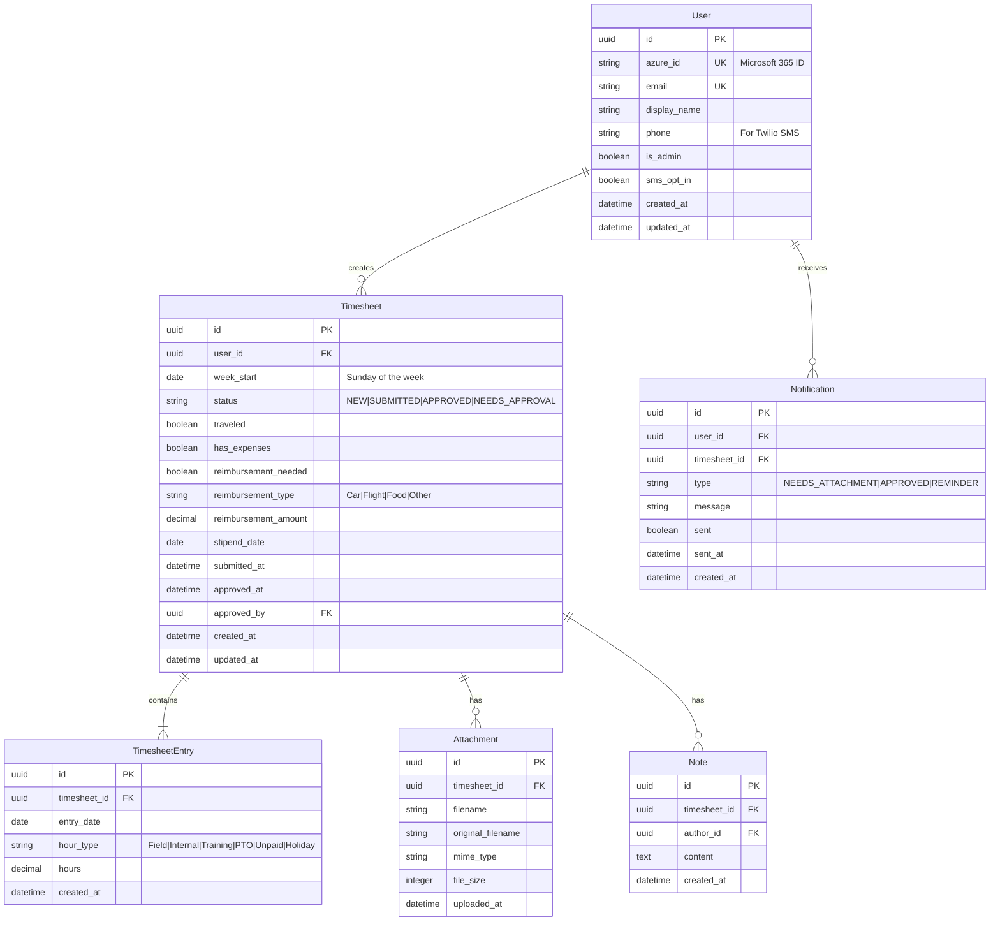

# Northstar Timesheet - Implementation Guide

Replacing the PowerApps timesheet solution with a modern Flask + vanilla JS/CSS application for ~60 users.

## Current Status

| Component          | Status                                            |
| ------------------ | ------------------------------------------------- |
| **Core App**       | ✅ Functional - CRUD, attachments, admin workflow |
| **Authentication** | ✅ Microsoft 365 / MSAL integrated                |
| **UI/UX**          | ✅ Forest green theme, premium design             |
| **Test Suite**     | ✅ 85 tests, 74% coverage                         |
| **Deployment**     | ✅ Docker Compose (local)                         |
| **UI Refactor**    | 🚧 In progress (`UI` branch)                      |
| **Teams Bot**      | 📋 Planned (`bot` branch)                         |

---

## Screenshots

### Reference: PowerApps Current UI


_Current PowerApps dashboard showing sidebar navigation, timesheet list, and star logo_


_PowerApps timesheet entry form with time grid and action buttons_

### New Implementation: Flask App


_New Flask implementation with forest green theme and premium UI_

---

> **📁 File Storage: Local Filesystem**
>
> Attachments (images/PDFs for field hours) are currently stored on the local filesystem via Docker volume.
> For production scaling, consider migrating to Azure Blob Storage or S3/R2.

> **📎 Field Hours Attachments**
>
> Field hours require an uploaded approval document (images/PDFs accepted).
> This is enforced during timesheet submission.

---

## System Architecture


### Runtime Flow

In Docker, the request flow is:

1. `nginx` serves as reverse proxy and handles SSE-friendly proxy settings for `/api/events`.
2. `web` runs `gunicorn` with `gevent` workers and serves both API and static/template routes.
3. `db` is PostgreSQL (persistent volume).
4. `redis` supports SSE pub/sub (persistent volume).

---

## Database Schema



---

## API Endpoints

### Authentication

| Method | Endpoint         | Description                 |
| ------ | ---------------- | --------------------------- |
| GET    | `/auth/login`    | Redirect to Microsoft login |
| GET    | `/auth/callback` | OAuth callback handler      |
| POST   | `/auth/logout`   | End session                 |
| GET    | `/auth/me`       | Get current user info       |

### Timesheets (Regular User)

| Method | Endpoint                                 | Description                           |
| ------ | ---------------------------------------- | ------------------------------------- |
| GET    | `/api/timesheets`                        | List user's timesheets (with filters) |
| POST   | `/api/timesheets`                        | Create new draft timesheet            |
| GET    | `/api/timesheets/{id}`                   | Get timesheet with entries            |
| PUT    | `/api/timesheets/{id}`                   | Update draft timesheet                |
| DELETE | `/api/timesheets/{id}`                   | Delete draft timesheet                |
| POST   | `/api/timesheets/{id}/submit`            | Submit timesheet for approval         |
| POST   | `/api/timesheets/{id}/entries`           | Add/update time entries               |
| POST   | `/api/timesheets/{id}/attachments`       | Upload attachment                     |
| DELETE | `/api/timesheets/{id}/attachments/{aid}` | Remove attachment                     |
| POST   | `/api/timesheets/{id}/notes`             | Add note                              |

### Admin Endpoints

| Method | Endpoint                                       | Description                   |
| ------ | ---------------------------------------------- | ----------------------------- |
| GET    | `/api/admin/timesheets`                        | List all submitted timesheets |
| GET    | `/api/admin/timesheets/{id}`                   | Get timesheet details         |
| POST   | `/api/admin/timesheets/{id}/approve`           | Approve timesheet             |
| POST   | `/api/admin/timesheets/{id}/reject`            | Mark as needs approval        |
| POST   | `/api/admin/timesheets/{id}/unapprove`         | Revert approval               |
| GET    | `/api/admin/timesheets/{id}/attachments/{aid}` | Download attachment           |
| POST   | `/api/admin/timesheets/{id}/notes`             | Add admin note                |
| GET    | `/api/admin/users`                             | List all users                |

### Real-time Updates

| Method | Endpoint      | Description                      |
| ------ | ------------- | -------------------------------- |
| GET    | `/api/events` | SSE stream for real-time updates |

---

## File Structure

```
timesheet/
├── app/
│   ├── __init__.py              # App factory
│   ├── config.py                # Configuration classes
│   ├── extensions.py            # Flask extensions (db, migrate, etc.)
│   │
│   ├── models/
│   │   ├── __init__.py
│   │   ├── user.py              # User model
│   │   ├── timesheet.py         # Timesheet + Entry models
│   │   ├── attachment.py        # Attachment model
│   │   ├── note.py              # Note model
│   │   └── notification.py      # Notification model
│   │
│   ├── routes/
│   │   ├── __init__.py
│   │   ├── auth.py              # /auth/* endpoints
│   │   ├── timesheets.py        # /api/timesheets/* endpoints
│   │   ├── admin.py             # /api/admin/* endpoints
│   │   └── events.py            # /api/events SSE endpoint
│   │
│   └── utils/
│       ├── __init__.py
│       └── decorators.py        # @login_required, @admin_required
│
├── static/
│   ├── css/
│   │   ├── main.css             # Global styles
│   │   └── components.css       # Reusable components
│   │
│   ├── js/
│   │   ├── app.js               # Main application
│   │   ├── api.js               # API client wrapper
│   │   ├── timesheet.js         # Timesheet form logic
│   │   ├── admin.js             # Admin dashboard logic
│   │   └── sse.js               # Server-sent events handler
│   │
│   └── img/
│       └── logo.svg             # Northstar logo
│
├── templates/
│   ├── base.html                # Base template
│   ├── index.html               # Main app (SPA-style)
│   └── login.html               # Login page
│
├── docker/
│   ├── Dockerfile
│   ├── docker-compose.yml
│   └── nginx.conf
│
├── docs/
│   └── images/                  # Documentation images
│
├── uploads/                      # Local file storage
├── requirements.txt
├── .env.example
└── README.md
```

---

## Authentication Flow


**Dev Mode**: When Azure AD credentials are not configured, the app creates a local admin session automatically.

---

## 🔒 OAuth Implementation: Microsoft 365 Authentication

> **Status: ✅ IMPLEMENTED**
>
> Microsoft 365 authentication is now fully working with MSAL and multi-tenant support.

### Current Implementation

The timesheet app uses **MSAL** (Microsoft Authentication Library) for OAuth2/OpenID Connect:

| Setting          | Value                                           |
| ---------------- | ----------------------------------------------- |
| **Library**      | `msal.ConfidentialClientApplication`            |
| **Tenant**       | `common` (multi-tenant - any Microsoft account) |
| **Scopes**       | `openid`, `profile`, `email`, `User.Read`       |
| **Redirect URI** | `http://localhost/auth/callback`                |

### Configuration

Set these environment variables in `.env`:

```bash
AZURE_CLIENT_ID=your-app-client-id
AZURE_CLIENT_SECRET=your-client-secret-value
AZURE_TENANT_ID=common                        # Use 'common' for any MS account
AZURE_REDIRECT_URI=http://localhost/auth/callback
```

**To restrict to organization users only**: Change `AZURE_TENANT_ID` to your specific tenant ID.

### Dev Mode

When `AZURE_CLIENT_ID` or `AZURE_CLIENT_SECRET` are missing or contain placeholder values, the app falls back to development mode with test accounts:

- `user` / `user` → Regular user
- `admin` / `password` → Admin user

### Key Differences: spicyGuac vs Timesheet

| Aspect                 | **spicyGuac**                                               | **Timesheet**                                                |
| ---------------------- | ----------------------------------------------------------- | ------------------------------------------------------------ |
| **Library**            | **Authlib** (`authlib.integrations.flask_client`)           | **MSAL** (`msal.ConfidentialClientApplication`)              |
| **OAuth Registration** | Uses `OAuth.register()` with named providers                | Manual MSAL app creation per-request                         |
| **Token Parsing**      | `oauth.azure.parse_id_token(token, nonce=nonce)`            | `result.get("id_token_claims")`                              |
| **Nonce Handling**     | Explicit nonce generation & session storage                 | No nonce handling (future enhancement)                       |
| **Redirect Flow**      | `oauth.azure.authorize_redirect(redirect_uri, nonce=nonce)` | `msal_app.get_authorization_request_url()` → manual redirect |

### Future Enhancements

- Add nonce verification for additional security
- Consider switching to Authlib for consistency with spicyGuac

---

## Timesheet Workflow


---

## Hour Types & Business Logic

| Hour Type | Payable | Billable | Requires Attachment |
| --------- | ------- | -------- | ------------------- |
| Field     | ✅      | ✅       | ✅                  |
| Internal  | ✅      | ❌       | ❌                  |
| Training  | ❌      | ❌       | ❌                  |
| PTO       | ✅      | ❌       | ❌                  |
| Unpaid    | ❌      | ❌       | ❌                  |
| Holiday   | ✅      | ❌       | ❌                  |

### Hour Type Configuration

```python
HOUR_TYPE_CONFIG = {
    'Field': {
        'payable': True,
        'billable': True,
        'requires_attachment': True,  # Approval document required
    },
    'Internal': {
        'payable': True,
        'billable': False,
        'requires_attachment': False,
    },
    'Training': {
        'payable': False,
        'billable': False,
        'requires_attachment': False,
    },
    'PTO': {
        'payable': True,
        'billable': False,
        'requires_attachment': False,
    },
    'Unpaid': {
        'payable': False,
        'billable': False,
        'requires_attachment': False,
    },
    'Holiday': {
        'payable': True,
        'billable': False,
        'requires_attachment': False,
    },
}
```

### Calculation Functions

```python
def calculate_totals(timesheet):
    """Calculate payable, billable, unpaid hours"""
    totals = {'payable': 0, 'billable': 0, 'unpaid': 0}

    for entry in timesheet.entries:
        config = HOUR_TYPE_CONFIG[entry.hour_type]
        if config['payable']:
            totals['payable'] += entry.hours
        if config['billable']:
            totals['billable'] += entry.hours
        if not config['payable']:
            totals['unpaid'] += entry.hours

    return totals

def check_requires_attachment(timesheet):
    """Check if timesheet has field hours but no attachment"""
    has_field_hours = any(
        e.hour_type == 'Field' for e in timesheet.entries
    )
    has_attachment = len(timesheet.attachments) > 0

    return has_field_hours and not has_attachment
```

---

## Notification System

### Twilio Integration

```python
class NotificationService:
    def __init__(self, twilio_client, db):
        self.twilio = twilio_client
        self.db = db

    def notify_needs_attachment(self, timesheet):
        """Called when admin marks timesheet as NEEDS_APPROVAL"""
        user = timesheet.user
        if user.sms_opt_in and user.phone:
            message = f"Your timesheet for week of {timesheet.week_start} requires an attachment. Please upload and resubmit."
            self._send_sms(user.phone, message)
            self._log_notification(user, timesheet, "NEEDS_ATTACHMENT", message)

    def notify_approved(self, timesheet):
        """Called when admin approves timesheet"""
        user = timesheet.user
        if user.sms_opt_in and user.phone:
            message = f"Your timesheet for week of {timesheet.week_start} has been approved!"
            self._send_sms(user.phone, message)
            self._log_notification(user, timesheet, "APPROVED", message)

    def send_weekly_reminders(self):
        """Scheduled job - Friday afternoon"""
        # Find users without submitted timesheet for current week
        # Send reminder SMS to each
        pass
```

See [TWILIO.md](TWILIO.md) for complete setup guide.

---

## Server-Sent Events (SSE)

Real-time updates are delivered via SSE with Redis pub/sub:

```python
@events_bp.route('/api/events')
@login_required
def event_stream():
    def generate():
        pubsub = redis.pubsub()
        pubsub.subscribe(f'user:{current_user.id}')

        for message in pubsub.listen():
            if message['type'] == 'message':
                yield f"data: {message['data']}\n\n"

    return Response(
        generate(),
        mimetype='text/event-stream',
        headers={'Cache-Control': 'no-cache'}
    )
```

### Event Types

| Event                 | Recipient | Trigger                    |
| --------------------- | --------- | -------------------------- |
| `timesheet.approved`  | User      | Admin approves timesheet   |
| `timesheet.rejected`  | User      | Admin marks needs approval |
| `timesheet.submitted` | Admin(s)  | User submits timesheet     |

---

## Auto-Populate Feature

Create draft timesheets pre-filled with standard 8-hour field days:

```python
def create_auto_populated_draft(user, week_start):
    """Create draft with 8 hours Field per weekday"""
    timesheet = Timesheet(
        user_id=user.id,
        week_start=week_start,
        status='NEW'
    )

    # Add 8 hours Field for Mon-Fri
    for day_offset in range(1, 6):  # Mon=1 through Fri=5
        entry_date = week_start + timedelta(days=day_offset)
        entry = TimesheetEntry(
            timesheet=timesheet,
            entry_date=entry_date,
            hour_type='Field',
            hours=8.0
        )
        timesheet.entries.append(entry)

    return timesheet
```

---

## Development Phases

### Phase 1: Foundation (Week 1-2) ✅ Complete

- [x] Docker setup with Nginx + Gunicorn
- [x] Flask app factory with blueprints
- [x] PostgreSQL models with SQLAlchemy
- [x] MSAL authentication integration
- [x] Basic HTML templates and CSS
- [x] Alembic migrations

### Phase 2: Core Features (Week 3-4) ✅ Complete

- [x] Timesheet CRUD API endpoints
- [x] Time entry management
- [x] Draft/Submit workflow
- [x] File upload for attachments
- [x] JavaScript frontend for timesheet form

### Phase 3: Admin Features (Week 5) ✅ Complete

- [x] Admin dashboard
- [x] Approval workflow
- [x] Filtering and reporting
- [x] Admin notes

### Phase 4: Notifications & Polish (Week 6)

- [x] Twilio SMS integration → See [TWILIO.md](TWILIO.md)
- [x] SSE real-time updates
- [x] Weekly reminder job → See [TWILIO.md](TWILIO.md) (Unsubmitted Timesheet Reminder)
- [x] Auto-populate feature
- [x] Tooltips and UX refinements

### Phase 5: UI Refactor (Current - `UI` Branch) 🚧 In Progress

> **Branch:** `UI`  
> **Status:** Active development

- [x] Time entry "Add Row" UX (dropdown + add button) → See [UI.md](UI.md)
- [x] Horizontal table layout for hour types
- [x] Dark mode implementation → See [DARKMODE.md](DARKMODE.md)
- [x] Field hours attachment warning
- [ ] Feature parity with PowerApps → See [POWERAPPS.md](POWERAPPS.md)
- [ ] Light mode CSS backup created

### Phase 6: Integrations (Planned)

- [ ] Microsoft Teams Bot → See [BOT.md](BOT.md)
- [ ] Azure AD setup → See [AZURE.md](AZURE.md)
- [ ] Production deployment → See [roadmap.md](roadmap.md)

---

## Documentation Index

All feature documentation, planning guides, and reference materials are stored in the `docs/` folder.

### Document Purpose Guide

> **Confused about which doc to read?** Here's a quick guide:
>
> - **New developer?** Start with `README.md` → `WALKTHROUGH.md` → `IMPLEMENTATION.md`
> - **Setting up auth/SMS?** See `AZURE.md` or `TWILIO.md`
> - **Working on UI?** See `DARKMODE.md`, `UI.md`, or `POWERAPPS.md`
> - **Planning production deploy?** See `roadmap.md`
> - **Tracking what's done?** See the "Development Phases" section in this file

### Core Documentation

| File                                   | Purpose                                                                                                                                                                        | Phase   |
| -------------------------------------- | ------------------------------------------------------------------------------------------------------------------------------------------------------------------------------ | ------- |
| [../README.md](../README.md)           | **Project overview and quick start.** High-level features, installation, and getting started guide.                                                                            | All     |
| [IMPLEMENTATION.md](IMPLEMENTATION.md) | **Technical architecture and API reference (this file).** Database schema, endpoints, development phases, and checklist. This is the canonical source for project status.      | All     |
| [TESTING.md](TESTING.md)               | **Test suite documentation.** How to run tests, coverage goals, and testing strategy.                                                                                          | Phase 1 |
| [WALKTHROUGH.md](WALKTHROUGH.md)       | **End-user documentation.** Step-by-step guide to using the app: login flow, creating timesheets, admin functions. Screenshots and UI descriptions. Good for onboarding users. | All     |

### Feature Documentation

| File                         | Purpose                                                                                                                                                                                  | Phase   |
| ---------------------------- | ---------------------------------------------------------------------------------------------------------------------------------------------------------------------------------------- | ------- |
| [DARKMODE.md](DARKMODE.md)   | **Dark mode implementation plan.** YouTube/Material Design color system, elevation overlays, CSS variable strategy.                                                                      | Phase 5 |
| [UI.md](UI.md)               | **UI refactor notes.** Documents the "Add Row" pattern for time entries, replacing the original grid layout.                                                                             | Phase 5 |
| [POWERAPPS.md](POWERAPPS.md) | **Original PowerApps feature reference.** Complete documentation of the legacy app's UI, colors, workflows, and features for achieving parity. Used as a checklist for missing features. | Phase 5 |
| [LOGIN.md](LOGIN.md)         | **Microsoft-style login page design.** Mockups and implementation notes for matching Microsoft's login aesthetic.                                                                        | Phase 5 |
| [BOT.md](BOT.md)             | **Microsoft Teams chatbot planning.** Architecture, commands, Adaptive Cards, proactive notifications.                                                                                   | Phase 6 |

### Integration Guides

| File                   | Purpose                                                                                                                                                 | Phase      |
| ---------------------- | ------------------------------------------------------------------------------------------------------------------------------------------------------- | ---------- |
| [AZURE.md](AZURE.md)   | **Azure AD / Microsoft 365 setup.** App registration, redirect URIs, environment variables, permission scopes.                                          | Phase 1, 6 |
| [TWILIO.md](TWILIO.md) | **Twilio SMS notification setup.** Account configuration, testing, message templates, webhook handling, and the Unsubmitted Timesheet Reminder feature. | Phase 4    |

### Planning & Status

| File                     | Purpose                                                                                                                                                                                       | When to Use              |
| ------------------------ | --------------------------------------------------------------------------------------------------------------------------------------------------------------------------------------------- | ------------------------ |
| [roadmap.md](roadmap.md) | **Production hardening recommendations.** Security, scalability, deployment patterns, and architectural decisions for going to production. Forward-looking technical debt and best practices. | Before production deploy |

### File Purpose Comparison

| Question                                   | Document                               |
| ------------------------------------------ | -------------------------------------- |
| What features does the app have?           | README.md, WALKTHROUGH.md              |
| What's the database schema?                | IMPLEMENTATION.md                      |
| What API endpoints exist?                  | IMPLEMENTATION.md                      |
| What's done vs. remaining?                 | IMPLEMENTATION.md (Development Phases) |
| How do I set up Azure AD?                  | AZURE.md                               |
| How do I set up Twilio SMS?                | TWILIO.md                              |
| What did the original PowerApps look like? | POWERAPPS.md                           |
| How should we deploy to production?        | roadmap.md                             |
| What tests exist?                          | TESTING.md                             |

### File Organization

```
timesheet/
├── README.md                # Project overview (root)
│
└── docs/                    # All documentation
    │
    │── IMPLEMENTATION.md    # 📋 Technical architecture (this file)
    │                        #    - Database schema
    │                        #    - API endpoints
    │                        #    - Development phases & status
    │
    │── TESTING.md           # 🧪 Test suite guide
    │── WALKTHROUGH.md       # 👤 End-user guide
    │
    │── DARKMODE.md          # 🌙 Dark mode implementation (Phase 5)
    │── LOGIN.md             # 🔐 Microsoft login page design
    │── UI.md                # 🎨 UI refactor documentation
    │── POWERAPPS.md         # 📱 Original app feature reference
    │── BOT.md               # 🤖 Teams bot planning (Phase 6)
    │
    │── AZURE.md             # ☁️ Azure AD setup guide
    │── TWILIO.md            # 📱 Twilio SMS setup guide
    │
    │── roadmap.md           # 🚀 Production hardening recommendations
    │
    └── images/              # 📸 Screenshots and diagrams
```

---

## Quick Commands

```bash
# Start development server
cd docker && docker compose up -d

# View logs
docker compose logs -f web

# Rebuild after code changes
docker compose up --build -d web

# Run tests
pytest tests/ -v

# Run tests with coverage
pytest tests/ --cov=app --cov-report=html

# Hard refresh browser (bypass cache)
# Mac: Cmd+Shift+R | Windows: Ctrl+Shift+R

# Flask database migrations
docker exec timesheet-web-1 flask db migrate -m "Description"
docker exec timesheet-web-1 flask db upgrade
```

---

## Verification Plan

### Automated Tests

**Test Suite Status: ✅ 85 tests passing | 74% code coverage**

```bash
# Run all tests
pytest tests/ -v

# Run with coverage
pytest tests/ --cov=app --cov-report=html

# Run specific test file
pytest tests/test_models.py -v
```

### Test Files

| File                       | Tests | Description                                         |
| -------------------------- | ----- | --------------------------------------------------- |
| `tests/conftest.py`        | —     | Fixtures: app, client, users, timesheets            |
| `tests/test_models.py`     | 21    | User, Timesheet, Entry models, hour calculations    |
| `tests/test_timesheets.py` | 22    | CRUD, entries, submit workflow, notes               |
| `tests/test_admin.py`      | 24    | Admin endpoints, approval/rejection, access control |
| `tests/test_auth.py`       | 10    | Auth requirements, session, logout                  |

### Test Categories

- **Unit tests** for business logic (hour calculations, status transitions)
- **API integration tests** (endpoint responses, auth requirements)
- **Database tests** (model relationships, constraints)
- **Access control tests** (admin vs regular user permissions)

### Coverage by Module

| Module                     | Coverage |
| -------------------------- | -------- |
| `app/models/`              | 95%+     |
| `app/routes/timesheets.py` | 72%      |
| `app/routes/admin.py`      | 85%      |
| `app/utils/decorators.py`  | 100%     |

### Manual Verification

#### Authentication Flow

- [ ] Login with Microsoft 365 account
- [ ] Verify session persists across page refreshes
- [ ] Logout and confirm session cleared

#### Timesheet Workflow

- [ ] Create new draft timesheet
- [ ] Add entries for each hour type
- [ ] Save draft, refresh, verify data persists
- [ ] Upload attachment for field hours
- [ ] Submit timesheet, verify status changes

#### Admin Workflow

- [ ] Login as admin
- [ ] View submitted timesheets (drafts should not appear)
- [ ] Approve a timesheet
- [ ] Mark one as "Needs Approval"
- [ ] Verify SMS sent (if Twilio configured)

#### Browser Compatibility

- [ ] Test in Chrome, Firefox, Safari
- [ ] Test responsive design on mobile viewport

---

## Configuration

Configuration is read from environment variables (also loaded from `.env` via `python-dotenv`).

Important env vars (see `.env.example` and `app/config.py`):

- `SECRET_KEY`
- `DATABASE_URL`
- `REDIS_URL`
- Azure AD (MSAL): `AZURE_CLIENT_ID`, `AZURE_CLIENT_SECRET`, `AZURE_TENANT_ID`, `AZURE_REDIRECT_URI`
- Twilio (optional): `TWILIO_ACCOUNT_SID`, `TWILIO_AUTH_TOKEN`, `TWILIO_PHONE_NUMBER`
- Uploads: `UPLOAD_FOLDER`, `MAX_CONTENT_LENGTH`

---

## Running the Application

### Docker (Recommended)

```bash
cd docker
docker-compose up --build
```

Access at: http://localhost

### Local venv

Requires local Postgres/Redis and env vars configured:

```bash
python3 -m venv .venv
source .venv/bin/activate
pip install -r requirements.txt
export FLASK_APP=app:create_app
flask run
```

---

## Code Quality

```bash
source .venv/bin/activate
black app
flake8 app
python -m compileall app
```

- `.flake8` is configured with `max-line-length = 88` to match Black

---

## Tasks

### Phase 2: Testing & Refinement

- [ ] **MSAL Authentication Integration**

  - [ ] Test Azure AD login flow end-to-end
  - [ ] Verify token refresh handling
  - [ ] Test logout and session cleanup
  - [ ] Confirm user creation/update on first login
  - [ ] See [AZURE.md](AZURE.md) for setup guide

- [x] **Twilio SMS Notifications** ✅ Completed Jan 6, 2026

  - [x] Implement `send_sms()` utility function
  - [x] Implement NotificationService
  - [x] Test approval notification delivery
  - [x] Test "needs attention" notification delivery
  - [x] Add error handling and logging for failed SMS
  - [x] See [TWILIO.md](TWILIO.md) for setup guide

- [ ] **Test Suite Improvements** → See [TESTING.md](TESTING.md)

  - [ ] Add tests for `app/utils/sms.py` (P0 - 0% → 100%)
  - [ ] Add tests for `app/services/notification.py` (P0 - 0% → 90%)
  - [ ] Add tests for attachment upload/download
  - [ ] Add tests for SSE events endpoint
  - [ ] Reach 85%+ code coverage (currently 74%)

- [ ] **Microsoft-Style Login Page** → See [LOGIN.md](LOGIN.md)

  - [ ] Create login.css with Microsoft brand styles
  - [ ] Update login.html template to match Microsoft design
  - [ ] Add gradient background, sharp-corner cards
  - [ ] Extract Microsoft logo SVG
  - [ ] Test responsive design on mobile

- [x] **Database Migrations** ✅ Completed Jan 6, 2026

  - [x] Initialize Alembic: `flask db init`
  - [x] Create baseline migration: `001_initial_schema.py`
  - [x] Stamp database: `flask db stamp 001_initial_schema`
  - [x] Verify: `flask db current` shows `001_initial_schema (head)`

- [ ] **Complete Workflow Testing**
  - [ ] Create new timesheet as regular user
  - [ ] Add time entries for full week
  - [ ] Upload attachment for field hours
  - [ ] Submit timesheet
  - [ ] Approve timesheet as admin
  - [ ] Verify SMS notification sent
  - [ ] Test "needs attachment" flow

### Phase 3: Integration Setup

- [ ] **Azure AD Configuration**

  - [ ] Create App Registration in Azure Portal
  - [ ] Configure redirect URIs for all environments
  - [ ] Create client secret
  - [ ] Grant admin consent for `User.Read` permission
  - [ ] Add credentials to `.env` file

- [ ] **Twilio Configuration**

  - [ ] Create Twilio account (or use existing)
  - [ ] Purchase SMS-capable phone number
  - [ ] Verify test phone numbers (if trial account)
  - [ ] Add credentials to `.env` file

- [ ] **User Onboarding**
  - [ ] Prepare list of ~60 users with emails
  - [ ] Identify admin users
  - [ ] Collect phone numbers for SMS opt-in (optional)

### Phase 4: Deployment

- [ ] **Pre-Deployment Checklist**

  - [ ] Set `SECRET_KEY` to a strong random value
  - [ ] Configure `DATABASE_URL` for production PostgreSQL
  - [ ] Set `AZURE_REDIRECT_URI` to production domain
  - [ ] Enable HTTPS (required for production OAuth)
  - [ ] Configure backup strategy for database

- [ ] **Docker Deployment**

  - [ ] Build production images: `docker-compose build`
  - [ ] Start services: `docker-compose up -d`
  - [ ] Run migrations: `docker-compose exec web flask db upgrade`
  - [ ] Verify application loads at production URL
  - [ ] Test authentication flow

- [ ] **Post-Deployment Verification**
  - [ ] Admin can log in and view submitted timesheets
  - [ ] Regular user can create and submit timesheet
  - [ ] File uploads work correctly
  - [ ] SMS notifications are delivered
  - [ ] SSE real-time updates function

### Phase 5: Production Hardening (Optional)

- [ ] **Monitoring & Logging**

  - [ ] Configure centralized logging (e.g., ELK, CloudWatch)
  - [ ] Set up uptime monitoring
  - [ ] Configure error alerting (e.g., Sentry)

- [ ] **Performance**

  - [ ] Enable Redis caching for sessions
  - [ ] Configure CDN for static assets
  - [ ] Load test with expected user count

- [ ] **Security Audit**
  - [ ] Review OWASP Top 10 checklist
  - [ ] Scan for dependency vulnerabilities
  - [ ] Verify CORS and CSP headers

---

## Open Questions

1. **File Storage**: Local vs. cloud - currently using local filesystem. Consider S3/Azure Blob for production?
2. **Field Hours Document**: What specific document is uploaded? Client sign-off sheet?
3. **Reporting**: Any export requirements (CSV, PDF reports)?
4. **Historical Data**: Need to migrate existing PowerApps data?
5. **Backup Strategy**: How frequently should database be backed up? Daily recommended.
6. **Domain**: What will be the production URL for the application?
7. **SSL Certificate**: Self-managed or automated (Let's Encrypt)?
